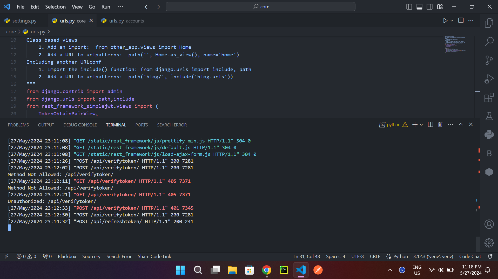
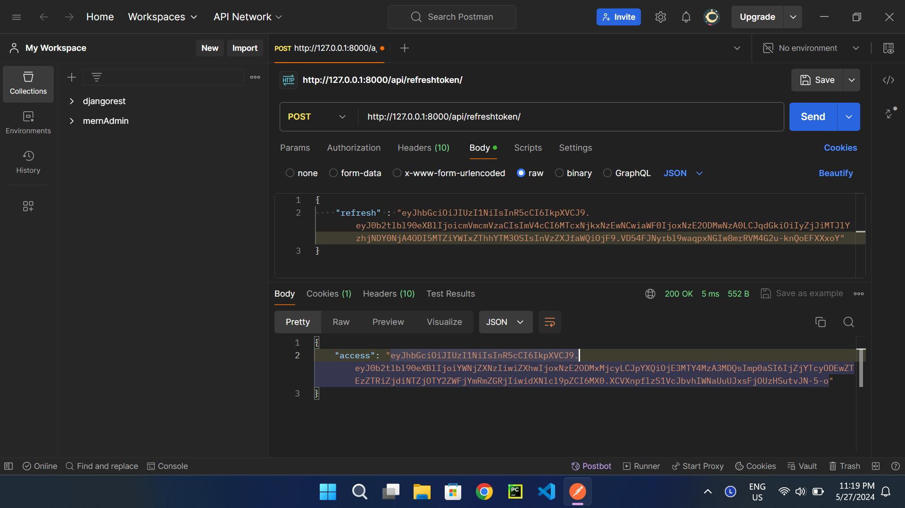
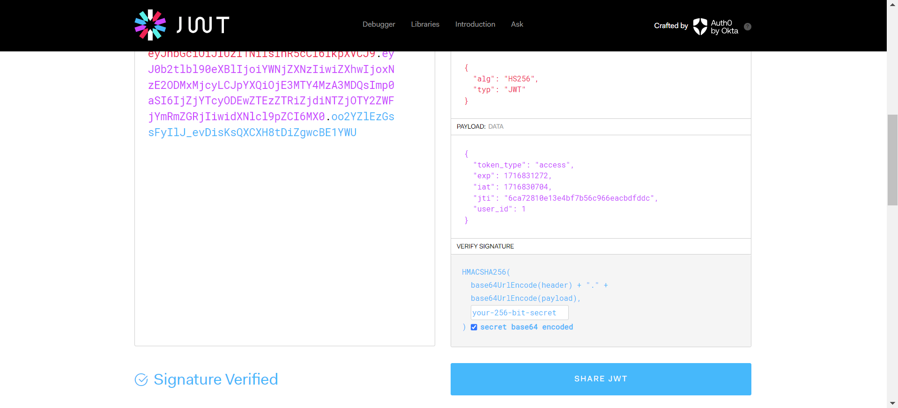
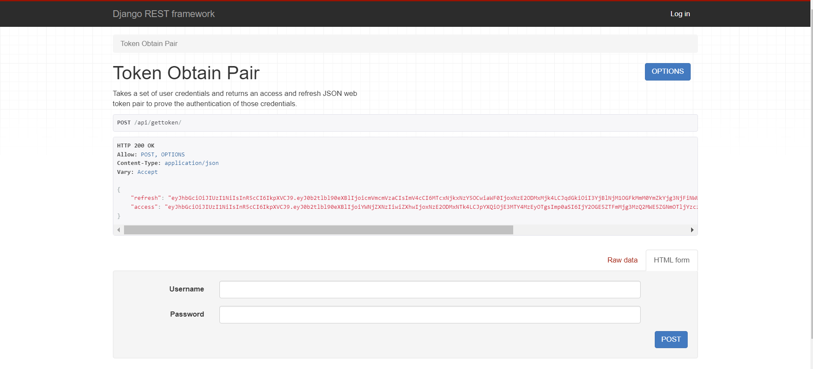

This is a completed project, where we have implimented JWT authentication on students table where data inside of students tables are modified,deleted and created using JWT authentication.
Here we have used token based authentication where access tokens and refresh tokens are used.

Screenshots of the projects are below.

This is a priview of first commit where we setup our JWT auth without any databases and students app.

